

    

## 프로젝트 개요

본 프로젝트는 2024년 제2회 경기도자율주행센터 데이터 활용 경진대회의 2D 객체 검지 과제를 수행한 결과물입니다. CCTV 이미지 데이터에서 버스, 자동차, 도로 표지판, 트럭, 사람, 특수 차량, 택시, 오토바이 총 8종 객체를 탐지하는 것을 목표로 했습니다.

도시 교통 환경에서는 불법 버스 탑승, 불법 우회전 등 위험 상황을 빠르게 감지해야 합니다. 이를 위해서는 CCTV 영상에서 객체를 정확하게 탐지하는 성능뿐만 아니라, 실제 서비스에 적용 가능한 빠른 추론 속도도 함께 필요합니다.

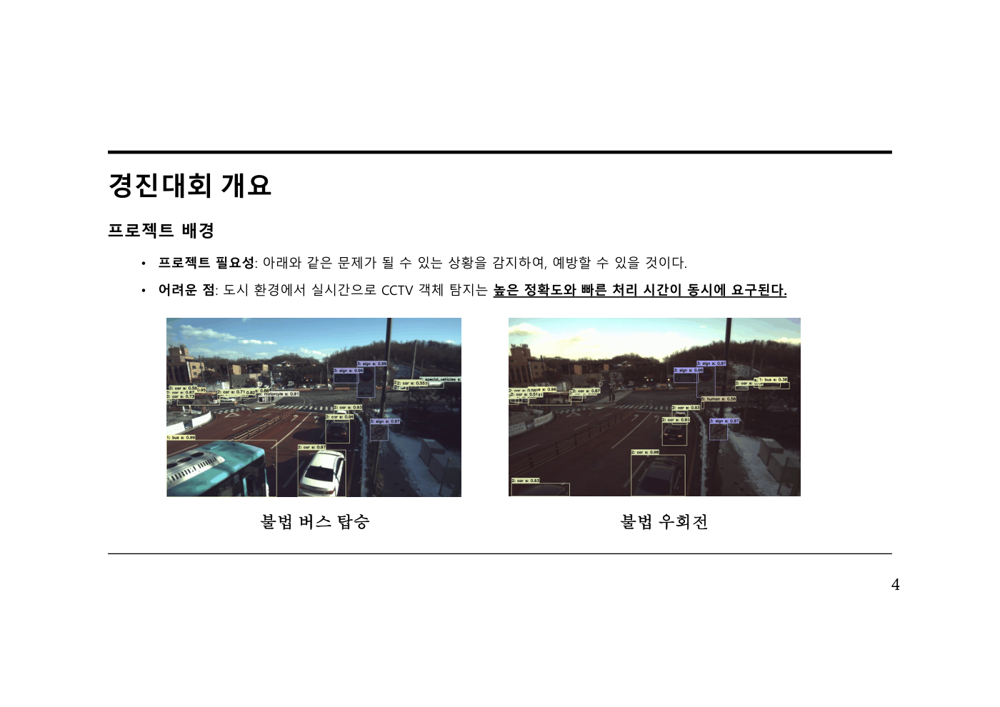

## 주요 목표

이 프로젝트의 핵심 목표는 다음과 같습니다.

- CCTV 이미지 내 8개 객체 클래스 탐지
- 클래스 불균형과 라벨 오류를 고려한 데이터 전처리
- 신뢰도 높은 검증 데이터 구성
- 정확도와 추론 속도를 함께 고려한 모델 선택
- 비 오는 날씨 조건에서도 안정적으로 동작하는 강건한 객체 탐지 모델 구축

## 데이터 구성

데이터는 학습 이미지 7,000장, 테스트 이미지 3,000장으로 구성되었습니다.

탐지 대상 클래스는 다음 8종입니다.

- bus, 버스
- car, 자동차
- sign, 도로 표지판
- truck, 트럭
- human, 사람
- special_vehicles, 특수 차량
- taxi, 택시
- motorcycle, 오토바이

데이터 분석 결과, car 클래스가 전체 annotation의 약 62.8%를 차지했고, special_vehicles는 약 0.8%, bus는 약 1.3% 수준으로 매우 적게 포함되어 있었습니다. 따라서 단순 학습만으로는 소수 클래스에 대한 성능이 낮아질 가능성이 있었습니다.

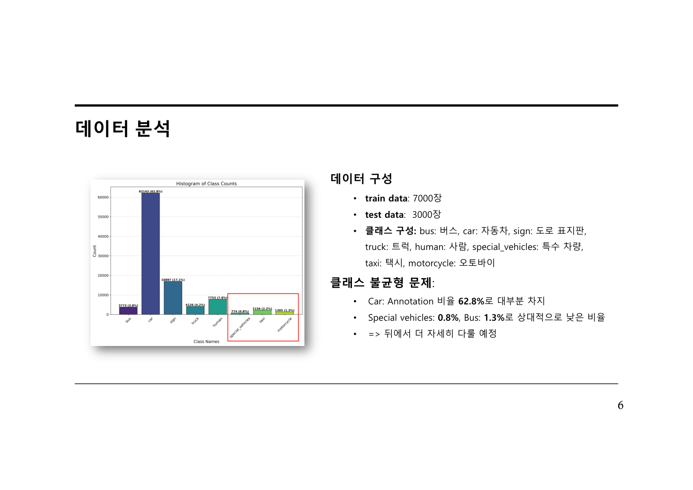

## 데이터 전처리

라벨링 품질을 확인하기 위해 바운딩 박스를 시각화하고 오류 패턴을 분석했습니다.

주요 오류는 다음과 같았습니다.

### Special Vehicle과 사람 간의 겹침 문제

일부 이미지에서 실제로 special vehicle 객체가 없는데도 사람과 겹친 위치에 special vehicle 라벨이 표시되는 문제가 있었습니다. 이 경우 잘못된 special vehicle 라벨을 제거하여 중복 표시 문제를 줄였습니다.

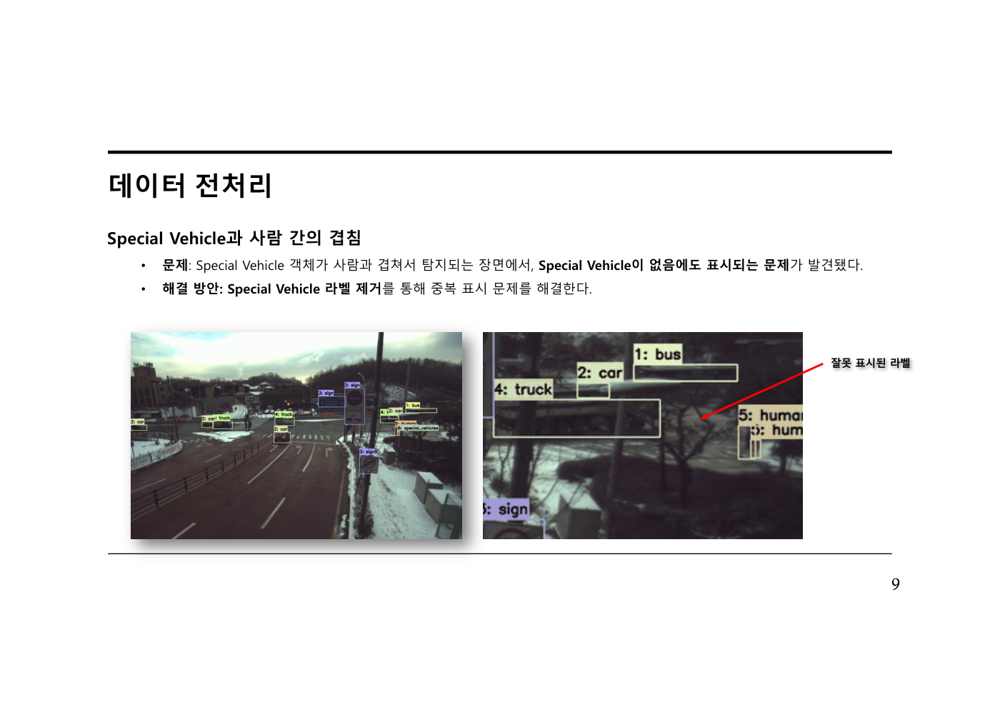

### Truck과 Special Vehicle 라벨 혼동

일부 차량이 truck으로 표시되어 있었지만, 실제로는 가스 수송 차량으로 special vehicle에 해당한다고 판단했습니다. 해당 라벨은 special vehicle로 수정했습니다.

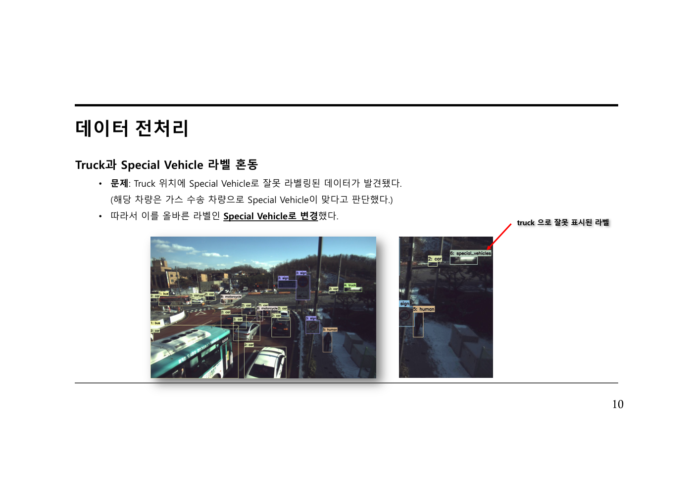

## 학습, 검증 데이터 구성

초기에는 CCTV 이미지가 시간적으로 연속된 데이터라는 점을 고려해 특정 연속 구간을 검증 데이터로 분리했습니다. 이 방식은 train과 validation 간 중복을 줄일 수 있다는 장점이 있었습니다.

하지만 구간 기반으로 분리하면 특정 클래스가 검증 데이터에 거의 포함되지 않는 문제가 발생했습니다. 특히 truck이나 special vehicle처럼 데이터 수가 적은 클래스는 검증 데이터에 충분히 반영되지 않아 모델 성능을 제대로 평가하기 어려웠습니다.

이를 해결하기 위해 Multi-label Stratified K-Fold를 적용했습니다. 전체 데이터를 5개의 train, validation 세트로 나누고, 각 fold에서 클래스 분포가 최대한 균일하게 유지되도록 구성했습니다. 이를 통해 모든 fold가 자동차, 사람, 특수 차량, 트럭 등 주요 클래스를 적절히 포함하도록 하여 검증 지표의 신뢰성을 높였습니다.

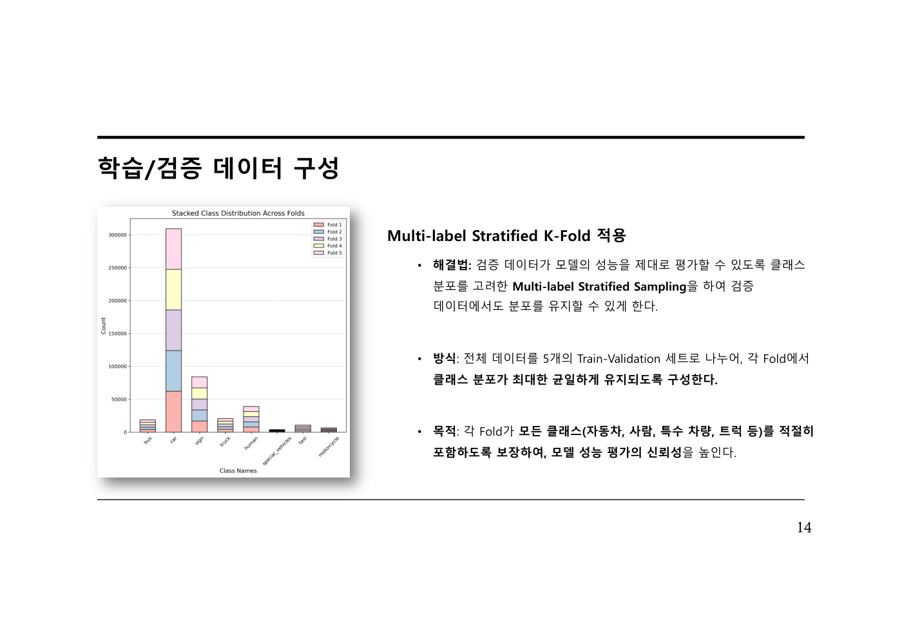

## 모델 선택

후보 모델로 RT-DETR과 YOLO11 계열을 비교했습니다.

RT-DETR은 높은 정확도를 기대할 수 있는 DETR 기반 모델이지만, 실험 결과 YOLO 계열에 비해 추론 시간이 크게 증가했습니다. 반면 YOLO11은 정확도와 속도의 균형이 좋아 실시간 객체 탐지에 적합했습니다.

실험 결과 YOLO11s가 가장 높은 Efficiency Score를 보였고, 최종 모델로 YOLO11s를 선택했습니다.

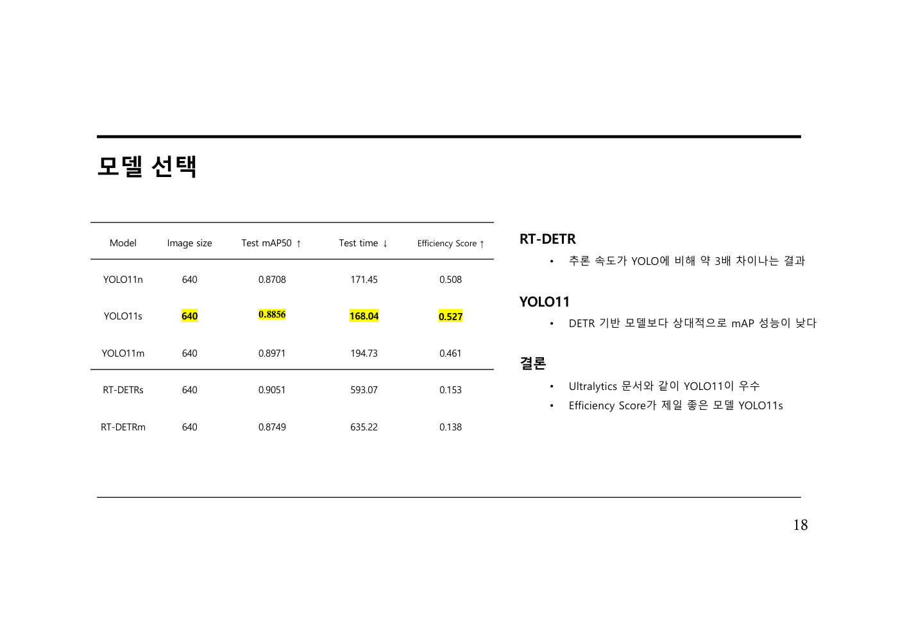

모델별 비교 결과는 다음과 같습니다.

| Model | Image Size | Test mAP50 | Test Time | Efficiency Score |
|---|---:|---:|---:|---:|
| YOLO11n | 640 | 0.8708 | 171.45 | 0.508 |
| YOLO11s | 640 | 0.8856 | 168.04 | 0.527 |
| YOLO11m | 640 | 0.8971 | 194.73 | 0.461 |
| RT-DETRs | 640 | 0.9051 | 593.07 | 0.153 |
| RT-DETRm | 640 | 0.8749 | 635.22 | 0.138 |

RT-DETRs는 mAP50이 높았지만 추론 시간이 YOLO 계열보다 약 3배 이상 길었습니다. 따라서 정확도와 속도를 함께 고려했을 때 YOLO11s가 가장 적합하다고 판단했습니다.

## 이미지 크기 최적화

입력 이미지 크기에 따른 성능과 속도도 비교했습니다.

- 1024 크기는 mAP50이 높았지만 추론 속도가 느려졌습니다.
- 420 크기는 속도는 빨랐지만 mAP50이 낮아졌습니다.
- 640 크기는 정확도와 속도의 균형이 가장 좋았습니다.

따라서 최종 입력 이미지 크기는 640으로 선택했습니다.

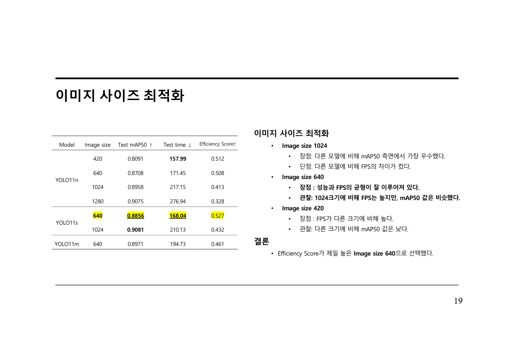

## 데이터 증강

기본 YOLO 증강 기법과 날씨 조건 증강을 함께 적용했습니다.

적용한 기본 증강은 다음과 같습니다.

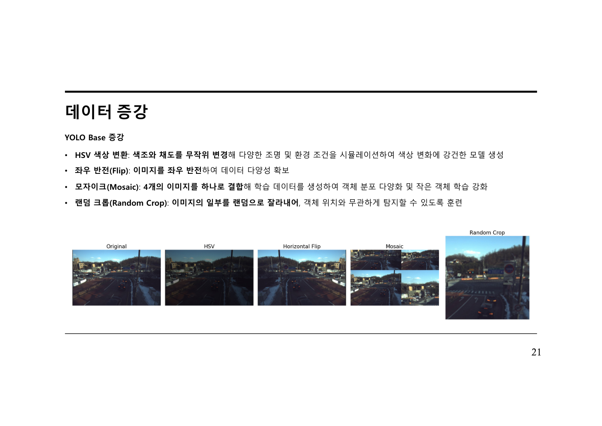

- HSV 색상 변환, 다양한 조명과 색상 변화에 대응
- 좌우 반전, 데이터 다양성 확보
- Mosaic, 4개 이미지를 결합해 객체 분포 다양화와 작은 객체 학습 강화
- Random Crop, 객체 위치 변화에 강건한 모델 학습

추가로 실제 교통 환경에서 비가 오는 상황을 반영하기 위해 RandomRain 증강을 적용했습니다.

비가 오는 상황에서는 도로 반사광, 흐린 시야, 낮아진 대비로 인해 객체 탐지 성능이 떨어질 수 있습니다. 따라서 성남 지역의 연평균 강수량을 참고해 약 23% 확률로 비 증강을 적용했습니다.

이를 통해 실제 환경에 가까운 데이터셋을 구성하고, 비 오는 날씨 조건에서도 안정적으로 객체를 탐지할 수 있도록 학습했습니다.

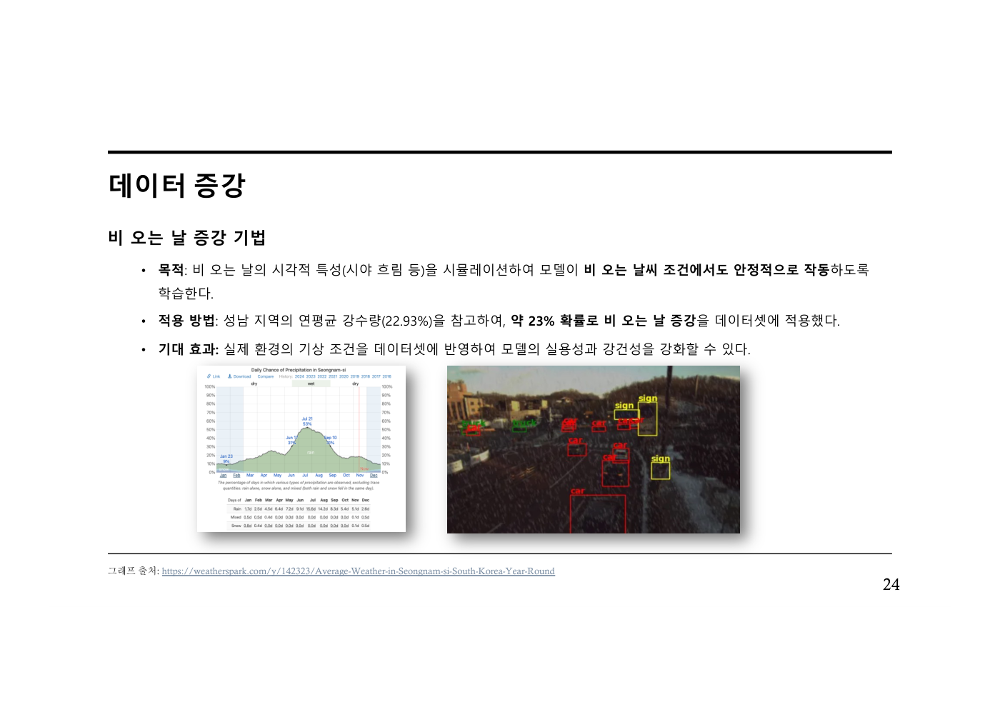

## 최종 학습 설정

최종 모델 설정은 다음과 같습니다.

| 항목 | 값 |
|---|---|
| Model | YOLO11s |
| Input Image Size | 640 |
| Epoch | 100 |
| Initial Learning Rate | 0.01 |
| Train Batch Size | 8 |
| Augmentation | RandomRain, YOLO Default Augmentation |
| Inference Batch Size | 8 |
| Inference Image Size | 640 |

## 최종 성능

최종 모델 성능은 다음과 같습니다.

| Metric | Result |
|---|---:|
| mAP50 | 0.8851 |
| Inference Time | 154.08s |
| Inference Time per Image | 51.36 ms/img |

## 시연 결과

비 증강을 적용하지 않은 Base Model과 RandomRain 증강을 적용한 최종 모델을 비교했습니다.

비가 오는 테스트 이미지에서 최종 모델은 sign, car 등의 객체를 더 안정적으로 탐지했습니다. 또한 truck과 motorcycle이 포함된 장면에서도 실제 존재하는 객체를 더 안정적으로 탐지했으며, 객체가 많은 복잡한 상황에서도 여러 객체를 안정적으로 검출했습니다.

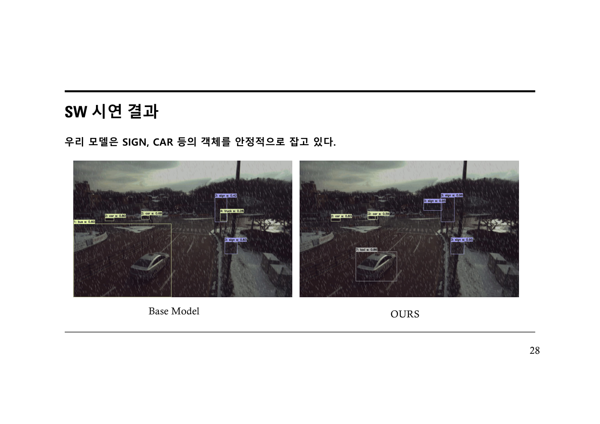

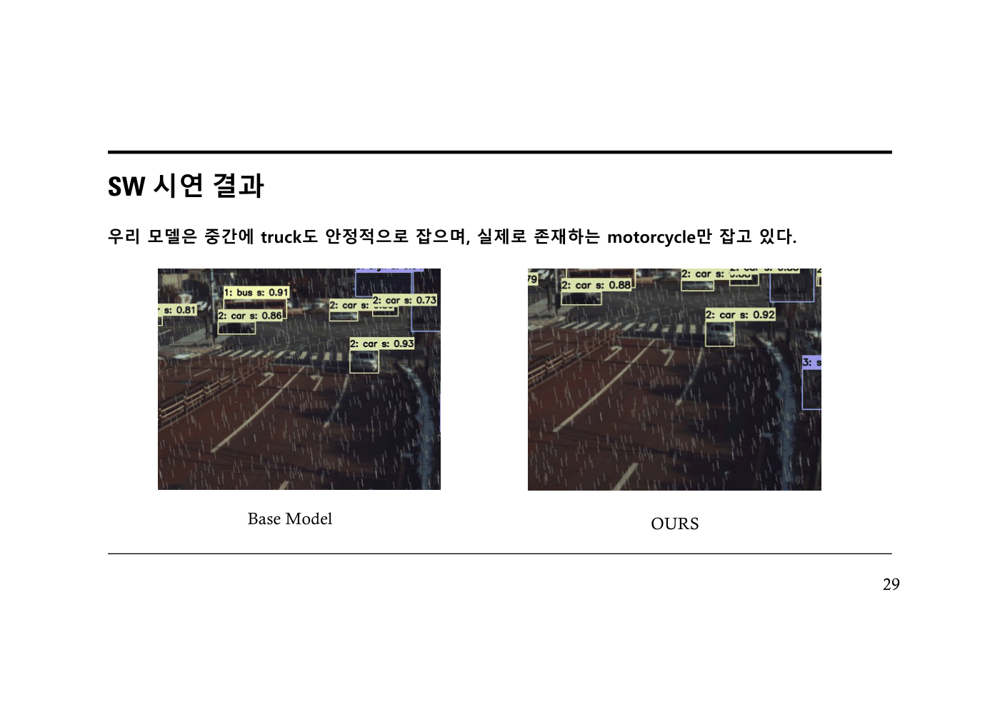

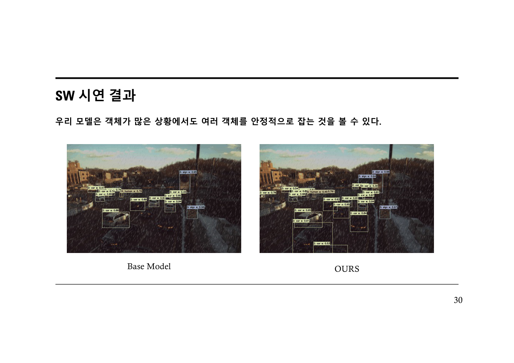

## 프로젝트 핵심 기여

이 프로젝트에서 중점적으로 수행한 작업은 다음과 같습니다.

- CCTV 객체 탐지 데이터의 클래스 불균형 분석
- 라벨링 오류 시각화 및 정제
- Multi-label Stratified K-Fold 기반 검증 데이터 구성
- YOLO11, RT-DETR 후보 모델 비교
- mAP50과 추론 시간을 함께 고려한 Efficiency Score 기반 모델 선택
- 입력 이미지 크기 최적화
- RandomRain 기반 날씨 조건 증강 적용
- 비 오는 환경에서도 강건한 객체 탐지 모델 구축

## 기술 스택

- Python
- Ultralytics YOLO11
- Object Detection
- Data Augmentation
- Multi-label Stratified K-Fold
- CCTV Image Dataset

## 결과 요약

본 프로젝트는 CCTV 기반 교통 객체 탐지 상황에서 정확도와 속도의 균형을 고려해 YOLO11s 모델을 선택하고, 데이터 오류 정제, 클래스 분포 기반 검증 데이터 구성, 날씨 조건 증강을 적용한 객체 탐지 파이프라인을 구축했습니다.

최종적으로 YOLO11s, image size 640 설정에서 mAP50 0.8851, 이미지당 추론 시간 51.36ms를 달성했으며, 비 오는 상황과 객체가 많은 장면에서도 안정적인 탐지 성능을 보였습니다.
